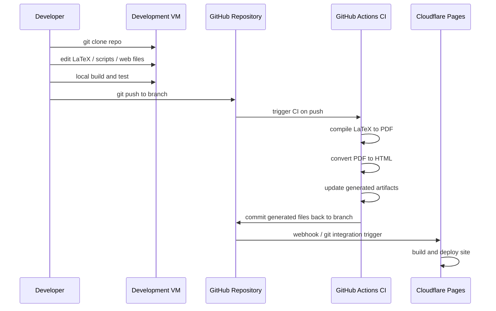
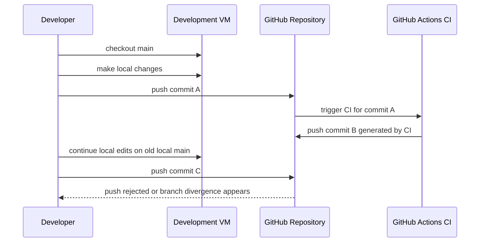

# Current Workflow

## Overview

This document describes the current workflow before the repository rearchitecture.

Current operating model:

1. clone this repository to a development VM
2. edit resume sources and run local development or test commands
3. push changes to GitHub
4. GitHub Actions CI is triggered automatically
5. CI rebuilds generated artifacts and commits them back to the repository
6. Cloudflare Pages receives the update and deploys automatically

This automation is functional, but it creates branch friction because CI writes back to the same branch that developers are actively using.

## Sequence Diagram

## Current Delivery Flow

The current repository behavior can be summarized as:

`developer VM -> GitHub push -> GitHub Actions build -> CI commit back to repo -> Cloudflare Pages deploy`

This means the repository is both:

- the source repository
- the generated artifact repository

That coupling is the main reason branch conflicts happen so easily.

## Conflict Scenario

Typical conflict flow:

## Why Branch Conflicts Happen

The current conflict pattern comes from these conditions:

- developers push source changes to a branch
- CI runs on that same branch
- CI generates files such as PDF or HTML artifacts
- CI commits those generated files back into the same branch
- the local branch on the development VM is now behind the remote branch

Once the developer continues working locally without first pulling or rebasing, the next push can hit:

- non-fast-forward push rejection
- branch divergence
- merge noise from generated files

## Root Cause

The core issue is not Git itself. The core issue is workflow design:

- source changes and generated output changes are committed to the same branch
- automation mutates the branch after the developer pushes
- deployment depends on repository state that is being rewritten by CI

This creates a feedback loop:

1. developer pushes
2. CI commits
3. remote branch moves
4. local branch becomes stale
5. next developer push collides with CI-generated history

## Current Pain Points

- developers need to pull or rebase more often than expected
- generated files create noisy diffs
- CI commits can obscure human-authored history
- deployment behavior is coupled to generated artifacts committed in Git
- branch state changes even when the developer did not make new source edits

## Short-Term Mitigations

Before the full architecture refactor is complete, these mitigations can reduce friction:

1. avoid direct work on a long-lived stale local branch without frequent `git pull --rebase`
2. keep generated artifact commits clearly identifiable
3. reduce the number of files CI commits back when possible
4. consider making deployment consume build artifacts instead of repo-written generated files

## Long-Term Direction

The long-term fix is to break the coupling between:

- source authoring
- generated artifacts
- deployment triggers

Target direction:

- source files remain the primary repository content
- CI builds outputs without mutating the same working branch
- deployment consumes build artifacts directly
- generated web output is no longer committed back just to drive deployment

That direction is described in:

- [rearchitecture-plan.md](./rearchitecture-plan.md)
- [content-model.md](./content-model.md)
- [future-workflow.md](./future-workflow.md)
- [index.md](./index.md)
