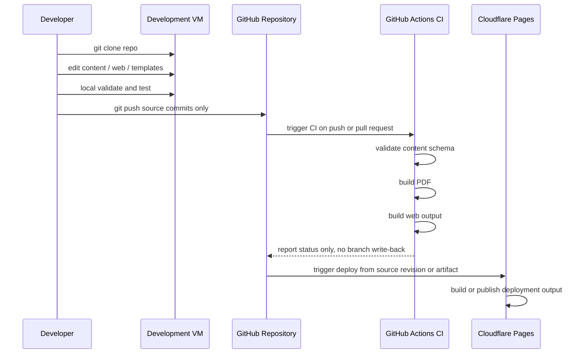
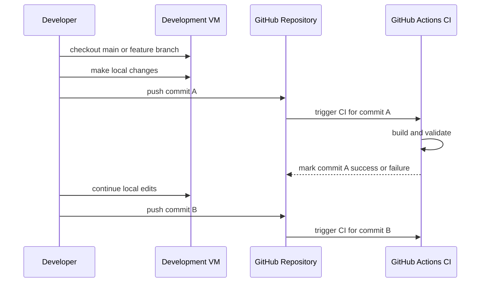

# Future Workflow

## Goal

This document describes the recommended future workflow after the repository rearchitecture.

The main objective is:

**CI/CD should stop writing generated artifacts back to the same working branch.**

That change removes the current feedback loop where:

1. developer pushes source changes
2. CI rebuilds outputs
3. CI commits generated files back to the same branch
4. remote history moves unexpectedly
5. the developer's local branch diverges

## Design Target

The future workflow should separate:

- source authoring
- build output generation
- deployment delivery

The repository should primarily store source files, not CI-regenerated deployment artifacts.

## Recommended High-Level Model

Recommended model:

1. developer edits source content locally
2. developer pushes source-only commits to GitHub
3. GitHub Actions validates and builds the project
4. deployment consumes CI build output directly
5. no CI commit is pushed back to the same branch

## Recommended Sequence Diagram



## Branch Behavior Difference

### Current Behavior

Current behavior:

- developer pushes commit A
- CI creates commit B on the same branch
- local branch becomes stale immediately

### Future Behavior

Future behavior:

- developer pushes commit A
- CI validates and builds commit A
- deployment publishes commit A output
- branch history remains stable unless a human pushes another commit

That difference is what removes the branch conflict loop.

## Future Conflict-Free Flow



In this model, CI does not mutate branch history. It only evaluates pushed revisions.

## Deployment Options

There are two reasonable deployment models for this repository.

### Option A: Cloudflare Builds From Git Source

Flow:

1. developer pushes source code to GitHub
2. GitHub Actions validates and optionally builds for verification
3. Cloudflare Pages pulls the same Git revision
4. Cloudflare builds and deploys from source

Good fit when:

- Cloudflare Pages can run the required web build
- PDF can be handled as a static asset or separate artifact
- you want simpler deployment ownership on the Cloudflare side

Key property:

- no generated output needs to be committed to Git

### Option B: GitHub Actions Builds and Deploys Artifact

Flow:

1. developer pushes source code to GitHub
2. GitHub Actions validates and builds deployable output
3. GitHub Actions uploads or publishes the artifact
4. Cloudflare Pages or Workers deploys the artifact directly

Good fit when:

- the CI environment is the canonical build environment
- the deployment output should be reproducible from a validated artifact
- you want tighter control of what exactly gets deployed

Key property:

- deployment consumes artifacts, not repo-written generated commits

## Recommended Branch Strategy

Recommended minimum strategy:

1. keep `main` as the deployable source branch
2. let developers work either directly on `main` with discipline or through short-lived feature branches
3. run CI on pushes and pull requests
4. never allow CI to push generated commits back to `main`

Safer preferred strategy:

1. developers work on feature branches
2. open pull requests into `main`
3. CI validates the pull request
4. merge to `main`
5. deployment runs from the merged source revision

This is better because:

- `main` stays cleaner
- deploys are tied to reviewed commits
- CI failure is caught before merge

## Future Build Responsibilities

### Repository Contents

The repository should store:

- structured content
- web source code
- LaTeX templates
- scripts
- configuration

The repository should not need to store as primary workflow artifacts:

- CI-regenerated HTML exports
- CI-regenerated PDF outputs committed after every push

### CI Responsibilities

CI should:

- validate schema and content
- build web output
- build PDF output
- run smoke tests
- publish status
- optionally publish artifacts

CI should not:

- rewrite the branch that triggered it
- add generated commits to the active developer branch

### CD Responsibilities

CD should:

- consume either source or build artifact
- deploy from a known Git revision
- avoid creating new source commits as part of deployment

## Example Future Pipeline

Suggested future pipeline:

```text
developer push
-> GitHub Actions validate-content
-> GitHub Actions build-web
-> GitHub Actions build-pdf
-> GitHub Actions smoke-test
-> deploy from source revision or build artifact
```

This pipeline is intentionally one-way:

`source commit -> build -> deploy`

It should not loop back into:

`source commit -> build -> commit generated files -> deploy`

## How This Prevents Branch Conflicts

Branch conflicts are reduced because:

- remote history changes only when humans merge or push source commits
- CI no longer inserts extra commits between developer pushes
- local branches do not become stale just because automation ran
- generated file noise disappears from normal source history

This does not eliminate all Git conflicts, but it removes the automation-induced ones that exist today.

## Migration Path From Current Workflow

Suggested transition:

1. stop treating `output/` as the canonical deployment source
2. move deployment toward web build output from the Next.js app
3. keep PDF generation in CI as an artifact-producing step
4. remove the GitHub Actions step that commits generated files back to the branch
5. update Cloudflare deployment so it builds from source or consumes published artifacts

## Practical CI/CD Policy Recommendation

Recommended policy for this repo:

1. source commits only come from developers or approved dependency automation
2. generated outputs are built in CI but not committed back automatically
3. release artifacts may be uploaded, attached, or deployed, but not written into active source branch history
4. `main` reflects authored source state, not build-side mutation

## Future State Summary

Target future flow:

```text
Dev VM -> GitHub source commit -> GitHub Actions validate/build -> Cloudflare deploy
```

Not:

```text
Dev VM -> GitHub source commit -> GitHub Actions build -> CI commit back -> Cloudflare deploy
```

That single change is the main workflow improvement needed to eliminate the current CI/CD-induced branch divergence problem.

## Related Documents

- [current-workflow.md](./current-workflow.md)
- [rearchitecture-plan.md](./rearchitecture-plan.md)
- [content-model.md](./content-model.md)
- [index.md](./index.md)
